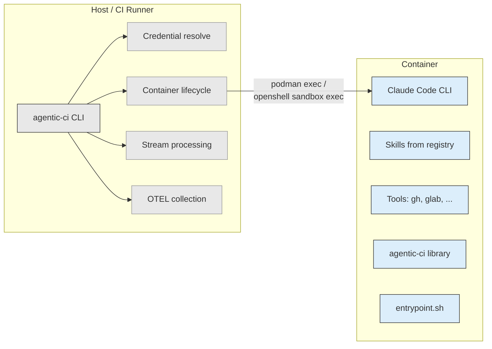

# Container Image

`quay.io/aipcc/agentic-ci/claude-runner`

Production container image for running Claude Code in agentic CI
workflows. Rebuilt daily to pick up fresh skill versions and security
patches.

## Architecture



The **agentic-ci** orchestrator runs on the host. It creates the
container with `--entrypoint sleep`, then calls `podman exec` or
`openshell sandbox exec` to run Claude inside it. Credentials are
mounted read-only from the host. OTEL metrics are collected on the host.

The **container image** is a toolbox: Claude Code + skills + tools. The
entrypoint handles credential setup only for standalone use (direct
`podman run` without agentic-ci).

## What's included

### System tools

| Category | Tools |
|----------|-------|
| Runtime | python3, git |
| HTTP | curl, jq |
| Build | make, which, tar, xz |
| VCS CLIs | gh (GitHub), glab (GitLab) |
| Linting | shellcheck, ruff |
| Python | uv |
| Library | agentic-ci |

### Pre-installed skills

All plugins from the
[opendatahub-io/skills-registry](https://github.com/opendatahub-io/skills-registry)
are pre-installed:

| Plugin | Description |
|--------|-------------|
| odh-ai-helpers | Python packaging, CI/CD debugging, Jira, ADR review |
| rfe-creator | RFE creation, review, and submission pipeline |
| assess-rfe | RFE quality assessment with structured rubric |
| rhoai-security-reviewer | Consensus-based security review for STRATs |
| test-plan | Test planning, generation, and automation |
| quality-tooling | Repository analysis and build validation |
| agent-eval-harness | Agentic evaluation with MLflow support |
| meeting-quality-skills | Pre-meeting quality checks |

## Dependency pinning

Every binary tool is pinned to a specific version and verified with a
SHA256 checksum. Only x86_64 binaries are included.

| Tool | Pinning |
|------|---------|
| ShellCheck | Version + SHA256 |
| gh | Version + SHA256 |
| glab | Version + SHA256 |
| uv | Version + SHA256 |
| Python packages | Version-pinned via `uv pip install` |

The image is rebuilt daily on a schedule, refreshing all skill versions
and picking up base image security patches. Date-stamped tags
(`YYYYMMDD`) provide rollback points.

## Usage

### Standalone (direct podman run)

Pass GCP credentials as environment variables. The entrypoint normalizes
them and writes gcloud config automatically:

```bash
podman run --rm \
  -e GCLOUD_CREDENTIALS="$GCLOUD_CREDENTIALS" \
  -v ./workspace:/workspace \
  quay.io/aipcc/agentic-ci/claude-runner:latest \
  claude -p "fix the failing test" \
    --model claude-opus-4-6 \
    --permission-mode bypassPermissions
```

### With agentic-ci (recommended)

The agentic-ci CLI handles container lifecycle, credential injection,
streaming output, and OTEL telemetry:

```bash
agentic-ci run "fix the failing test" --workdir ./workspace
```

### Shell access

```bash
podman run --rm -it \
  quay.io/aipcc/agentic-ci/claude-runner:latest \
  bash
```

## Entrypoint behavior

| Command | Result |
|---------|--------|
| `podman run image` | Runs `claude` interactively |
| `podman run image claude -p "prompt"` | Runs a prompt |
| `podman run image bash` | Shell access for debugging |
| `podman run --entrypoint sleep image 1200` | agentic-ci mode |

The entrypoint supports two credential sources (checked in order):

1. `GCLOUD_CREDENTIALS` — raw JSON or base64-encoded GCP credentials
2. `GCP_SERVICE_ACCOUNT_KEY` — base64-encoded credentials (fallback)

If neither is set, `ANTHROPIC_API_KEY` is used directly (no gcloud
config needed).

## Tags

| Tag | Description |
|-----|-------------|
| `latest` | Most recent build |
| `YYYYMMDD` | Date-stamped build (e.g. `20260514`) |

## CI pipeline

The image is built by a GitHub Actions workflow
(`.github/workflows/images.yml`) that triggers on:

1. Push to main when `images/**` files change
2. Daily schedule (6am UTC)
3. Tag pushes
4. Manual dispatch via `workflow_dispatch`
